# Inventory Management System

## Project Overview

The Inventory Management System is a Java-based desktop application developed using Java Swing and MySQL. The system helps businesses manage products, record sales, maintain stock levels, generate reports, and manage users through a user-friendly graphical interface.

This project was developed as a mini project to demonstrate the use of Java GUI programming, database connectivity using JDBC, and report generation using iText PDF.

---

## Technologies Used

* Java
* Java Swing
* MySQL / MariaDB
* JDBC (Java Database Connectivity)
* Apache NetBeans
* XAMPP
* iText PDF Library
* Git and GitHub

---

## Features

### User Authentication

* Secure login system
* Role-based access control
* Admin and Staff user roles

### Product Management

* Add new products
* Delete products
* View available products
* Manage stock quantity
* Store product category and pricing information

### Sales Management

* Record product sales
* Automatic stock reduction after sales
* Validation for available inventory

### Report Generation

* View sales history
* Generate PDF reports
* Display stock availability reports

### User Management

* Add new users
* Delete existing users
* Assign roles (Admin or Staff)

---

## Database Structure

### Users Table

| Column   | Description        |
| -------- | ------------------ |
| UserID   | Unique User ID     |
| Username | Login Username     |
| Password | Encrypted Password |
| Role     | Admin or Staff     |

### Products Table

| Column   | Description      |
| -------- | ---------------- |
| Barcode  | Product Barcode  |
| Name     | Product Name     |
| Price    | Product Price    |
| Quantity | Available Stock  |
| Category | Product Category |

### Sales Table

| Column       | Description           |
| ------------ | --------------------- |
| SaleID       | Unique Sale ID        |
| Barcode      | Product Barcode       |
| QuantitySold | Quantity Sold         |
| SaleDate     | Date and Time of Sale |

---

## Project Modules

### Login Module

Validates user credentials and grants access based on user roles.

### Product Module

Allows users to manage inventory items and monitor stock availability.

### Sales Module

Records sales transactions and updates inventory automatically.

### Reports Module

Generates inventory and sales reports in PDF format.

### User Module

Provides user administration features for authorized users.

---

## Software Requirements

* Java JDK 8 or later
* Apache NetBeans IDE
* XAMPP
* MySQL Connector/J
* iText PDF Library

---

## How to Run the Project

1. Start Apache and MySQL in XAMPP.
2. Create the database:

   * AdvancedInventoryDB
3. Create the required tables:

   * Users
   * Products
   * Sales
4. Add an admin user.
5. Add MySQL Connector/J library to the project.
6. Add iText PDF library to the project.
7. Run LoginForm.java.
8. Login using valid credentials.

---

## Output

The application provides:

* Product management interface
* Sales recording interface
* User management interface
* PDF report generation

---

## Learning Outcomes

Through this project, the following concepts were implemented:

* Java Swing GUI Development
* JDBC Database Connectivity
* SQL Queries and Database Design
* Object-Oriented Programming
* Report Generation using iText PDF
* Git and GitHub Version Control

---

## Future Enhancements

* Barcode Scanner Integration
* Product Update Functionality
* Dashboard with Charts
* Email Notifications
* Cloud Database Support
* Inventory Forecasting

---

## Author

Gowsalya

Mini Project – Inventory Management System

---

## Output Screenshots

### Login Screen

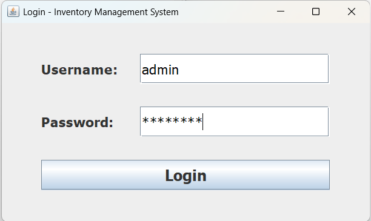

**Description:** User authentication screen where users enter their username and password to access the system.

---

### Main Menu

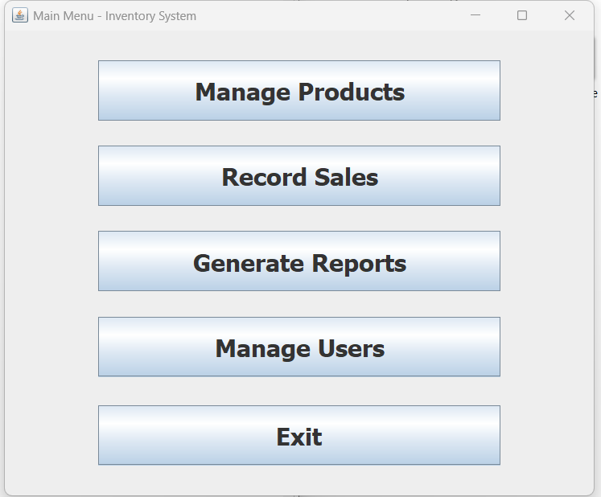

**Description:** Main dashboard that provides access to Product Management, Sales Management, Report Generation, and User Management modules.

---

### Product Management

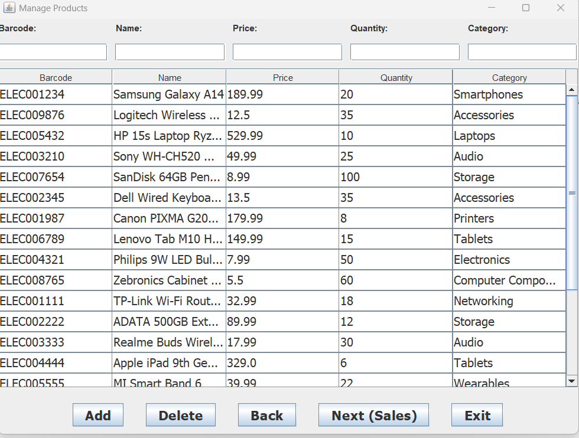

**Description:** Allows users to add, view, and delete products. Displays product barcode, name, price, quantity, and category.

---

### User Management

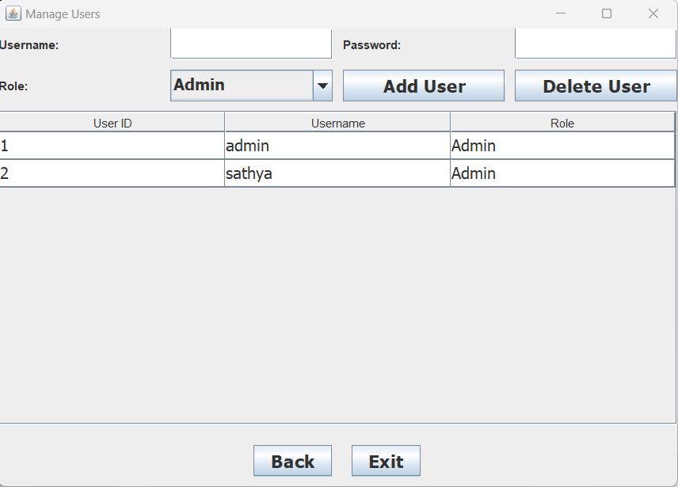

**Description:** Admin module used to manage system users and assign roles.

---

### User Added Successfully

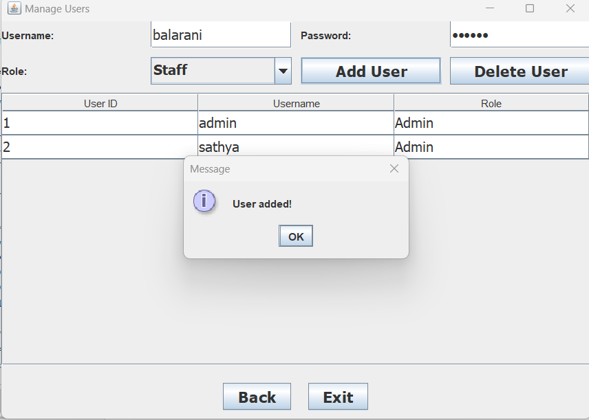

**Description:** Confirmation message displayed after successfully adding a new user to the system.

---

### Record Sales Screen

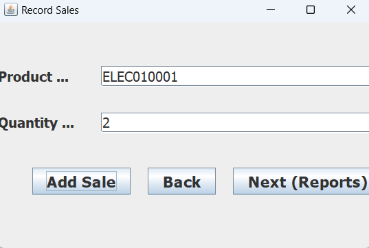

**Description:** Interface used to record product sales by entering the product barcode and quantity sold.

---

### Sale Recorded Successfully

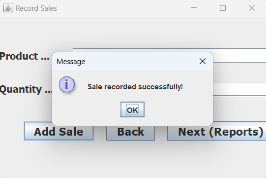

**Description:** Confirmation message displayed after a sale transaction is successfully recorded.

---

### Reports Module

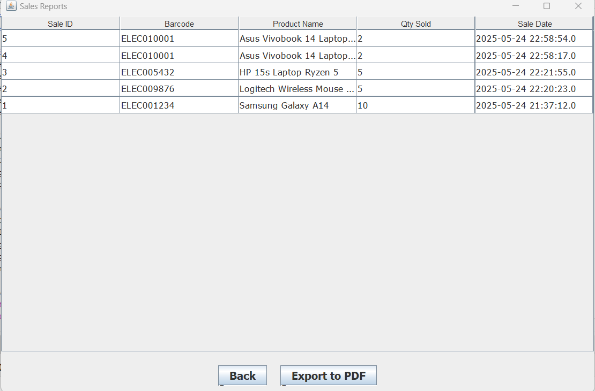

**Description:** Displays sales transactions and inventory details for report generation.

---

### Report Generated Successfully

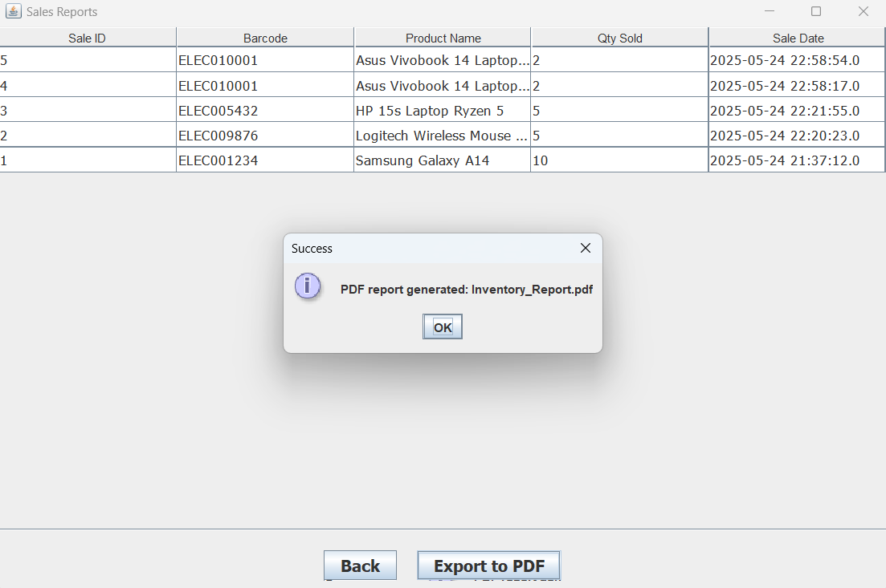

**Description:** Notification shown after the PDF report is generated successfully.

---

### Generated PDF File

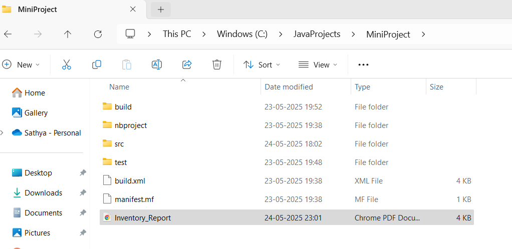

**Description:** Shows the generated Inventory Report PDF file saved in the project directory.

---

### PDF Report Preview

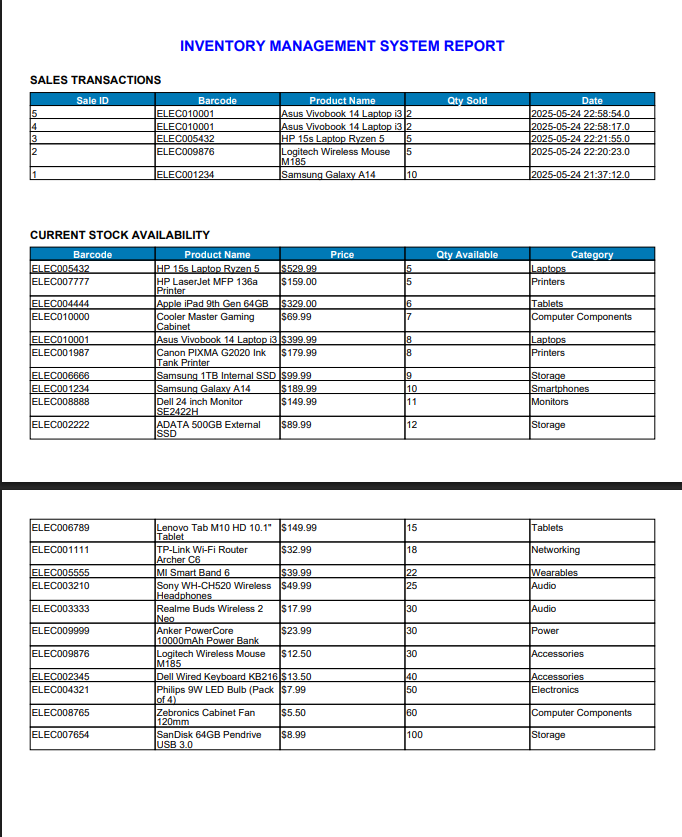

**Description:** Preview of the generated PDF report containing sales transactions and stock availability information.

---

## Conclusion

The Inventory Management System successfully demonstrates the implementation of Java Swing GUI development, JDBC database connectivity, MySQL database management, user authentication, inventory control, sales tracking, and PDF report generation. The project provides an efficient solution for managing inventory operations and serves as a practical application of object-oriented programming and database concepts.

---
